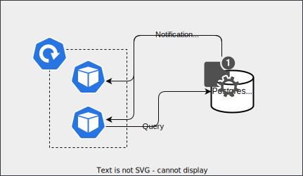

# Scheduler

Scheduler can perform actions on cron expression. It uses postgres for storing schedules.

## Architecture

The Scheduler App is a Go-based application that manages cronjobs stored in a **PostgreSQL** database. The application is designed with the following components:

### APIs

The API layer is the interface through which clients interact with the Scheduler App. It exposes REST APIs that allow clients to **create**, **read**, **update**, and **delete** schedules. It also provides endpoints for **querying the history of past occurrences.**

### Data

The data layer consists of the PostgreSQL database that stores the **schedules**, **next_occurrence**, and **history** tables.

### Job scheduling

The job scheduling component is responsible for executing jobs at their specified times. It uses **SIGALRM** to schedule jobs and queries the next_occurrence table to determine when the next job should be executed.

### Notification system

The notification system is responsible for notifying the Scheduler App of any changes to the next_occurrence table. It uses **PostgreSQL's LISTEN NOTIFY** feature to monitor the table for changes and sends notifications to the Scheduler App when changes occur.

### Hooks system

The hooks system allows for custom actions to be taken when a job is executed. Hooks are Go functions that take a context. The context provides access to the necessary data for executing the job.

