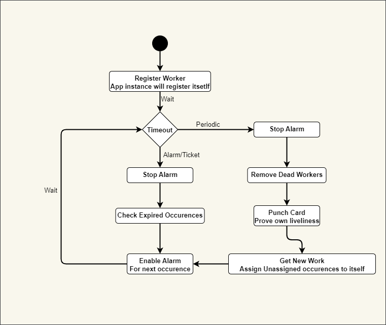
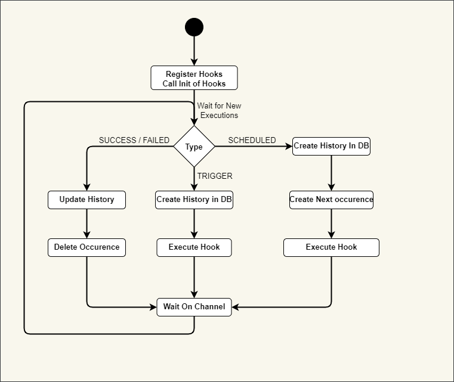
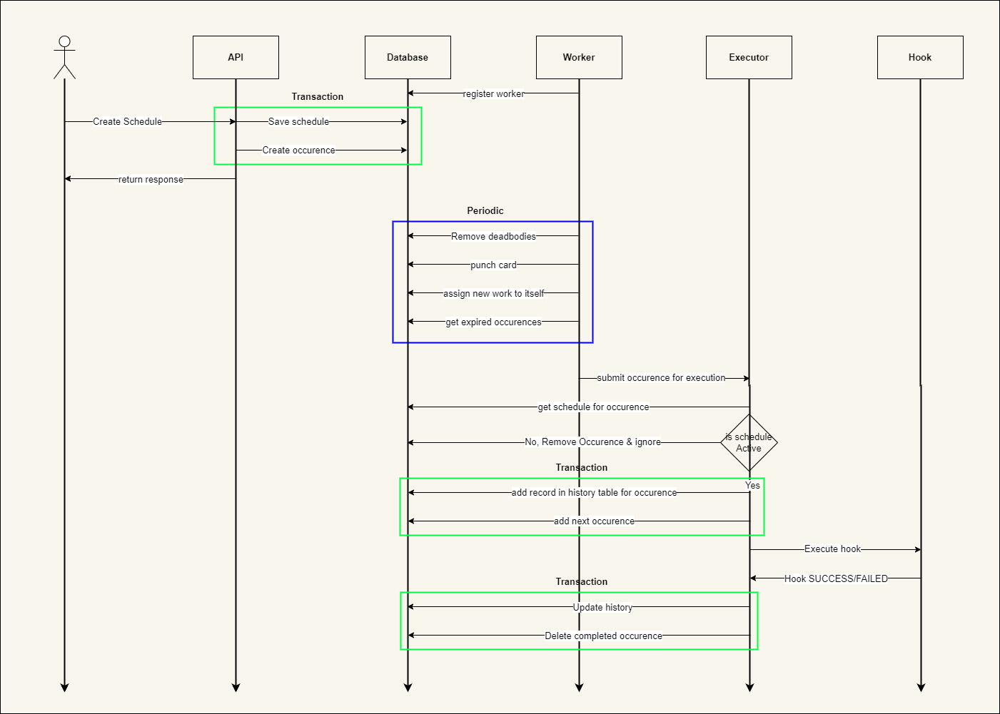

# Scheduler

Scheduler can perform actions on cron expression. It uses postgres for storing schedules.

## Architecture

The Scheduler App is a Go-based application that manages cronjobs stored in a **PostgreSQL** database. The application is designed with the following components:

### APIs

The API layer is the interface through which clients interact with the Scheduler App. It exposes REST APIs that allow clients to **create**, **read**, **update**, and **delete** schedules. It also provides endpoints for **querying the history of past occurrences.**

### Data

The data layer consists of the PostgreSQL database that stores the **schedules**, **next_occurrence**, and **history** tables. It is using `sqlc` for generating database related methods.

### Worker

Worker is current running instance of app. It will register itself in database, will own work/schedule occurence, and it will hand over occurence to executor when occurence expire. It is also responsible to unown occurences from dead workers.

### Hooks system & Executor

The hooks system allows for custom actions to be taken when a occurence is expired. Hooks are Go functions that take a context. The context provides access to the necessary data for executing the hook.

### Main Flow

